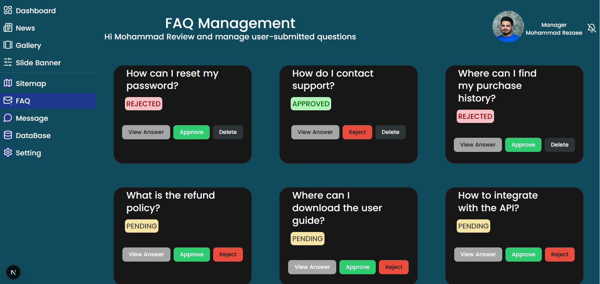
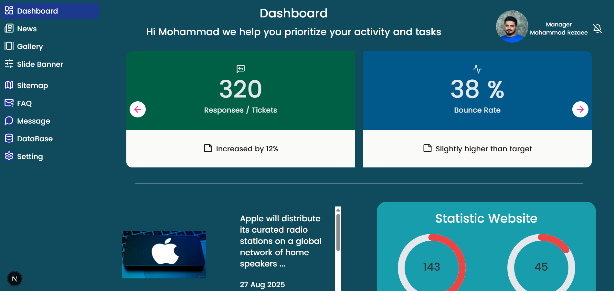
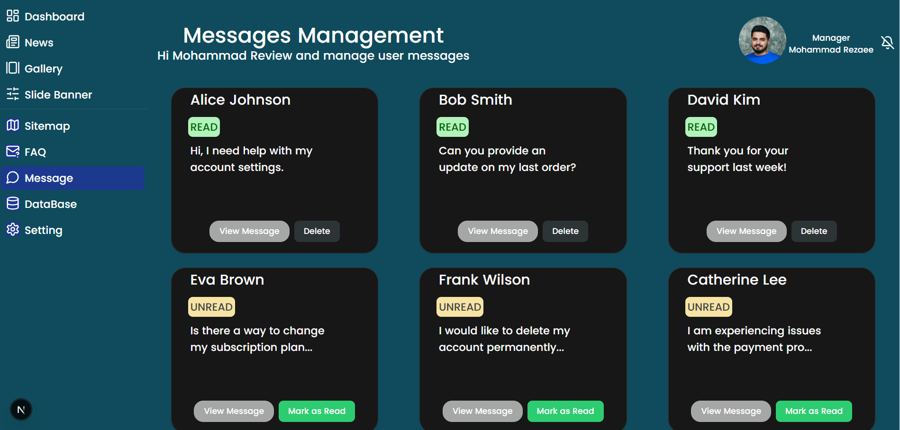
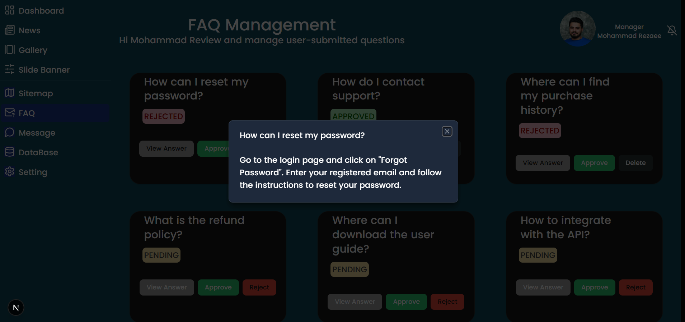
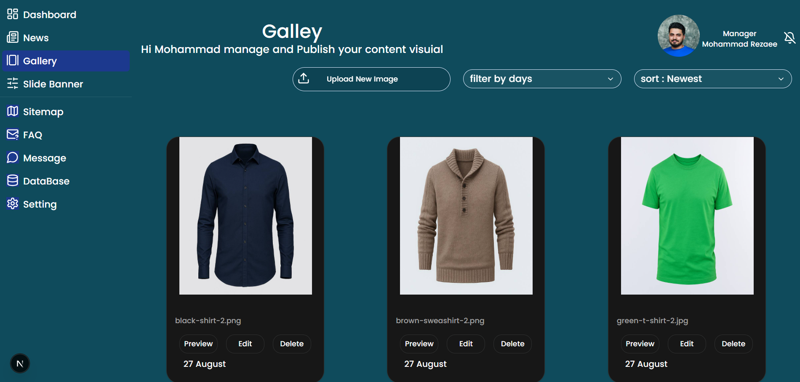
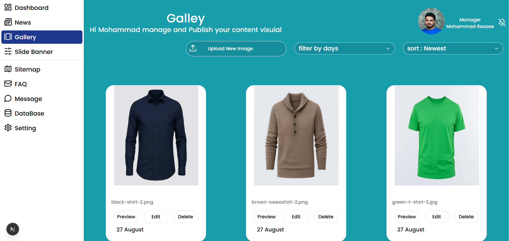
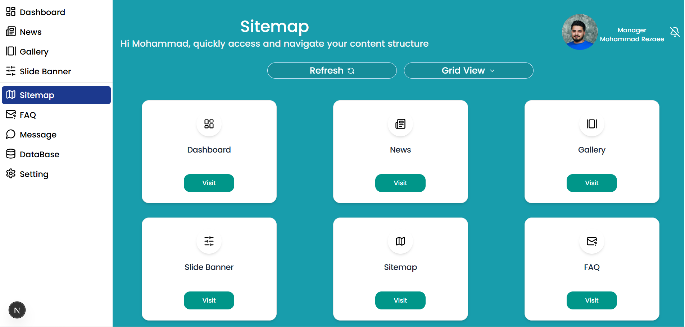

# 🚀 Admin Dashboard with ShadCN UI, React & TypeScript
## یک داشبورد ادمین کامل ساخته شده با **React**, **Next.js 13**, **TypeScript** و **ShadCN UI** برای مدیریت کاربران، تصاویر، محصولات و آمار وبسایت

#### 🔗[Click here to see the live demo](https://admin-dashboard-rouge-chi.vercel.app/Dashboard)


## 🎯 ویژگی‌های پروژه

- **داشبورد ریسپانسیو** با طراحی مدرن و قابل استفاده در موبایل و دسکتاپ
- **حالت تاریک / روشن** با Context API
- **مدیریت تصاویر** با آپلود، فیلتر بر اساس تاریخ و مرتب‌سازی
- **مدیریت محصولات و بنرها** با ذخیره‌سازی در `db.json`
- **آمار سایت** با نمایش پیشرفت‌ها (Progress Bar)
- **کامپوننت‌های از پیش طراحی شده** با ShadCN UI
- **استفاده از React Query** برای fetch و cache داده‌ها
- **ساختار TypeScript** برای ایمنی بیشتر کد

---

## 🧩 کامپوننت‌های کلیدی

### 1️⃣ Sidebar
- ناوبری اصلی داشبورد
- پشتیبانی از حالت تاریک / روشن
- آیکون‌ها و لینک‌های صفحات
- نوتیفیکیشن با `NotificationBell`

### 2️⃣ UserCard
- نمایش کاربر مدیریت‌کننده
- Avatar با fallback
- اطلاعات کاربری

### 3️⃣ SettingsPage
- مدیریت تنظیمات:  
  - Dark Mode  
  - Notifications  
  - Location Access  
  - Email Alerts  
  - Beta Features  
  - Data Sync  
- ذخیره‌سازی خودکار در `localStorage`  
- نوتیفیکیشن برای تغییر وضعیت تنظیمات

### 4️⃣ Sitemap Page
- نمایش ساختار صفحات با **Grid View / List View**  
- دکمه Refresh برای بارگذاری دوباره
- هر بخش با **SiteCard** قابل دسترسی است

### 5️⃣ SiteCard
- نمایش هر صفحه یا بخش با آیکون و نام
- دکمه Visit برای دسترسی سریع

### 6️⃣ EmptyState
- نمایش حالت خالی برای تصاویر یا بنرها
- آیکون `UploadCloud` و پیام مناسب

### 7️⃣ UploadButton
- آپلود فایل تصویر
- تبدیل به Base64 و فشرده‌سازی
- افزودن خودکار به context و ارسال به API

### 8️⃣ Progress
- نمایش آمار به صورت دایره‌ای
- دریافت مقدار هدف و نمایش پیشرفت

### 9️⃣ Slider
- نمایش آمار یا کارت‌ها به صورت اسلایدر
- استفاده از Swiper.js
- کاملاً ریسپانسیو

### 🔟 Statistics
- دریافت آمار از `/api/data` با **React Query**
- نمایش `totalVisitors`, `todaysVisitors`, `todaysHits`, `totalHits` با Progress

### 1️⃣1️⃣ Hooks
- **useToast**: نمایش نوتیفیکیشن ساده با alert  
- **usePost**: ارسال داده‌ها به API
- **useConvertBase64**: فشرده‌سازی و تبدیل تصویر به Base64
- **useFetch**: fetch داده‌ها از API  

---

## 🗂️ ساختار پروژه

```text
src/
├─ app/
│  ├─ dashboard/
│  │  ├─ page.tsx
│  │  ├─ settings.tsx
│  │  └─ sitemap.tsx
├─ myComponents/
│  ├─ ContextProvider.tsx
│  ├─ DarkModeProvider.tsx
│  ├─ SideBar.tsx
│  ├─ UploadButton.tsx
│  ├─ UserCards.tsx
│  ├─ NotificationBell.tsx
│  ├─ SelectDemo.tsx
│  └─ Progress.tsx
├─ Components/
│  ├─ ui/
│  │  ├─ Button.tsx
│  │  ├─ Card.tsx
│  │  └─ Select.tsx
├─ hooks/
│  ├─ useToast.ts
│  ├─ useFetch.ts
│  ├─ usePost.ts
│  └─ useConvertBase64.ts
├─ data.ts
├─ db.json
└─ styles/
```


## ⚡ تکنولوژی‌ها و ابزارها

Next.js 13

React 18

TypeScript

ShadCN UI

Lucide Icons

Swiper.js

React Query

Tailwind CSS


## 🖼️ تصاویر پروژه

















## 💡 نکات مهم

تمام داده‌ها در فایل db.json ذخیره می‌شوند و با APIهای داخلی مدیریت می‌شوند.

تمام حالت‌ها و تنظیمات کاربر با localStorage ذخیره می‌شوند.

قابلیت Dark Mode با Context API مدیریت شده است.

تصاویر آپلود شده به Base64 تبدیل و فشرده می‌شوند.
